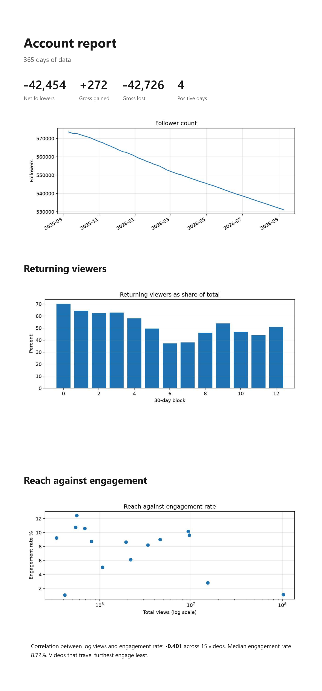

# socialsense

A small, extensible toolkit for turning raw social media analytics exports
into readable reports.

Built around one TikTok account with roughly 530k followers and twelve months
of data, but the loader layer is deliberately separated so other platforms can
be added without touching the metrics.



## Status

Work in progress.

- [x] Load follower history from TikTok exports
- [x] Reconstruct missing year information from date labels
- [x] Load overview, content and viewer exports
- [x] Metrics layer
- [x] Charts and HTML report
- [x] Tests
- [ ] Sample data so the project runs without a real export

## Why the structure looks like this

The layers change at different speeds, so they live in different modules:

| Module | Responsibility | Knows about |
|---|---|---|
| `loaders.py` | Read export files, return clean tables | File formats, column names |
| `metrics.py` | Turn tables into numbers | Only the column names we chose |
| `charts.py` | Turn tables into images | Nothing about files |
| `report.py` | Turn numbers into a report | Nothing about files |
| `cli.py` | Wire the above together | Everything, but only the order |

If TikTok renames a column, only `loaders.py` changes. If a new platform is
added, it gets a new loader and nothing else moves.

Every loader returns the same shape regardless of which platform it read, so
the metrics never need to know where a number came from. That separation is
also what makes the metrics testable: they never touch the filesystem, so they
can be run against a handful of rows written by hand.

## The date problem

TikTok exports label days as `September 10` with no year. A 365-row export
therefore spans two calendar years with nothing in the file to distinguish
them.

`dates.py` reconstructs the year by assuming rows are in chronological order
and incrementing whenever the month goes backwards, for example December to
January. The starting year is passed in as an argument rather than hardcoded
or read from the system clock, which keeps the function deterministic: the
same input always produces the same output, and it can be tested without any
real export files.

## What the loaders return

Four exports, four loaders, each returning a fixed set of columns:

| Loader | Source file | Columns |
|---|---|---|
| `load_followers` | `FollowerHistory.xlsx` | date, followers, delta |
| `load_overview` | `Overview.xlsx` | date, views, profile_views, likes, comments, shares |
| `load_viewers` | `Viewers.xlsx` | date, total_viewers, new_viewers, returning_viewers |
| `load_content` | `Content.xlsx` | title, posted, views, likes, shares, comments |

Column selection happens on the way out of every loader. If TikTok adds a
column to an export, the output of these functions does not change.

## Metrics

Three metrics, each answering a question the raw exports do not:

**`follower_churn`** separates gross gains from gross losses. TikTok reports
new followers per video but only net change per day, so a video that brings in
a thousand followers on a day that loses a thousand looks like nothing
happened. Splitting the two makes the underlying churn visible.

**`returning_ratio`** tracks what share of viewers are returning rather than
new, grouped into fixed-length blocks. Blocks are 30 rows rather than calendar
months so that every block is the same length and directly comparable. The
final block is shorter than the rest, so its totals should not be compared with
the others, only its ratio.

**`reach_vs_resonance`** correlates log view count against engagement rate
across videos. Views are logged because the range spans three orders of
magnitude, and without that a single outlier would dominate the correlation.

## Known data quirks

Things in the raw exports that the loaders have to account for, and some they
deliberately do not:

**Content dates cannot be resolved.** Unlike the daily exports, `Content.xlsx`
is sorted by view count rather than chronologically, so the year-reconstruction
trick in `dates.py` does not apply. `load_content` leaves the post date as text
rather than producing a date that would be silently wrong.

**Viewer counts are not always numeric.** `Total Viewers` contains at least one
value pandas cannot parse, so `load_viewers` coerces the column and lets the bad
rows become nulls instead of failing the whole load. The column ends up as a
float as a result.

**The exports do not cover identical date ranges.** The viewer export starts one
day later than the others, which matters when joining tables on date.

**Follower gains are already netted.** The daily figure is a net change, so a
day that gained a thousand followers and lost a thousand shows as zero. The
gross gain reported by `follower_churn` is a lower bound, not the real number
of people who hit follow.

**Comment counts are net, not gross.** The daily comment figure goes negative on
many days, which means deletions are being subtracted from new comments. The
loaders pass this through unchanged: it is a property of the source data, not
something to silently repair.

## Setup

```bash
python -m venv .venv
.venv\Scripts\Activate.ps1
pip install -r requirements.txt
```

Place TikTok exports in `data/`:

```
data/FollowerHistory.xlsx
data/Overview.xlsx
data/Content.xlsx
data/Viewers.xlsx
```

## Usage

```bash
python -m socialsense.cli
```

Writes three charts and `report.html` into `output/`.

## Tests

```bash
pytest
```

The metrics layer takes tables and returns numbers without touching the
filesystem, so every test runs against a three-row DataFrame written by hand
rather than a real export. The expected values can be worked out on paper,
which means a failing test points at the code rather than at the data.

`dates.py` has two tests rather than one: the first checks that the year
increments when the month goes backwards, the second checks that it does not
increment when the month does not. Without the second, a function that
incremented the year on every row would still pass.

## Note on data

The `data/` and `output/` directories are not committed. Sample files with the
same column shape and synthetic numbers are planned under `data/sample/` so the
project can be run without access to a real account export.